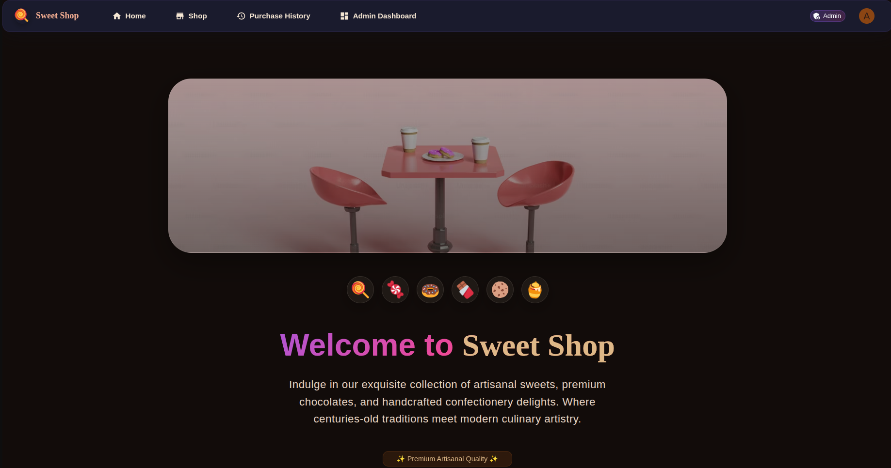
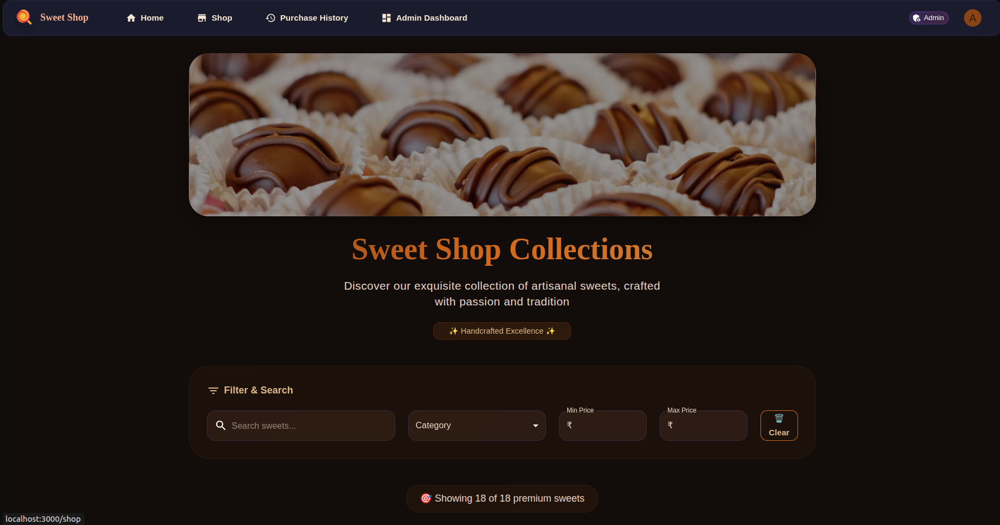
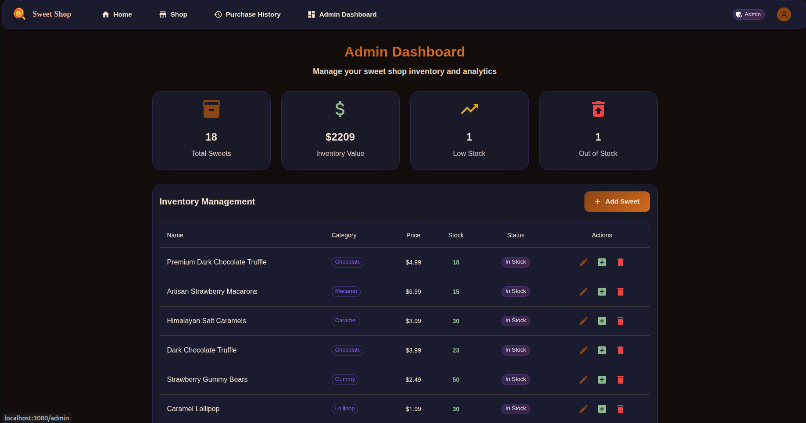
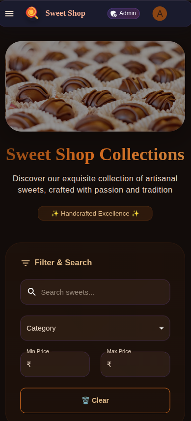

# 🍭 Sweet Shop - Full Stack E-Commerce Application

> A modern, premium sweet shop e-commerce platform built with cutting-edge technologies, featuring a robust Node.js/Express backend with SQLite database and an elegant Next.js frontend with Material-UI and Three.js animations.

## 📖 Project Overview

Sweet Shop is a comprehensive full-stack e-commerce application designed for selling confectionery items. The project demonstrates modern web development practices with a clean separation between backend and frontend, comprehensive testing, secure authentication, and a premium user experience.

### 🎯 Key Highlights
- **Full-Stack Architecture**: Clean separation between backend API and frontend client
- **Modern Tech Stack**: Node.js, Express, SQLite, Next.js, TypeScript, Material-UI
- **Premium UI/UX**: Brown-themed design with Three.js animations and responsive layout
- **Secure Authentication**: JWT-based auth with role-based access control
- **Comprehensive Testing**: High test coverage with Jest and React Testing Library
- **Production Ready**: Clean code structure, error handling, and deployment-ready

## 🚀 Features

### 🔧 Backend Features
- **RESTful API** with Express.js and SQLite database
- **JWT Authentication** with secure token management
- **User Management** - Registration, login, profile updates
- **Sweet Inventory** - CRUD operations with category management
- **Purchase System** - Order processing and inventory tracking
- **Search & Filtering** - Advanced search by name, category, price range
- **Admin Dashboard** - Inventory management and user administration
- **Security Features** - Rate limiting, CORS, input validation, password hashing
- **Comprehensive Testing** - 150+ tests with 90%+ coverage

### 🎨 Frontend Features
- **Next.js 14** with TypeScript for type safety
- **Material-UI v5** with custom brown theme
- **Three.js Integration** for 3D animations and visual effects
- **Responsive Design** - Mobile-first approach with elegant UI
- **Premium UX** - Smooth animations, hover effects, and modern interactions
- **Indian Rupee Support** - Localized currency formatting
- **Real-time Updates** - Dynamic inventory and cart management
- **Admin Interface** - Comprehensive management dashboard

## 📋 Prerequisites

Before running this project, ensure you have the following installed:

- **Node.js** (v16 or higher) - [Download here](https://nodejs.org/)
- **npm** (comes with Node.js) or **yarn**
- **Git** for version control
- **SQLite3** (automatically handled by the project)

## 🛠️ Local Setup Instructions

### 📁 Project Structure
```
SweetShop/
├── backend/           # Express.js API server
│   ├── config/        # Database configuration
│   ├── controllers/   # API controllers
│   ├── middleware/    # Authentication & validation
│   ├── models/        # Database models
│   ├── routes/        # API routes
│   ├── scripts/       # Database scripts
│   ├── tests/         # Backend tests
│   └── server.js      # Server entry point
└── frontend/          # Next.js client application
    ├── src/           # Source code
    ├── public/        # Static assets
    └── package.json   # Frontend dependencies
```

### 🔧 Backend Setup

1. **Navigate to the backend directory:**
   ```bash
   cd SweetShop/backend
   ```

2. **Install backend dependencies:**
   ```bash
   npm install
   ```

3. **Set up environment variables:**
   ```bash
   cp .env.example .env
   ```
   
   Edit `.env` file with your configuration:
   ```env
   NODE_ENV=development
   PORT=3001
   JWT_SECRET=999999
   JWT_EXPIRES_IN=7d
   ADMIN_EMAIL=admin@sweetshop.com
   ADMIN_PASSWORD=admin123
   RATE_LIMIT_WINDOW_MS=900000
   RATE_LIMIT_MAX_REQUESTS=100
   ```
   # Edit .env file with your configuration
   ```

4. **Database setup:**
   ```bash
   npm run db:migrate
   npm run db:seed
   ```

5. **Start the development server:**
   ```bash
   npm run dev
   ```

The API will be available at `http://localhost:3001`

### 🎨 Frontend Setup

1. **Navigate to the frontend directory:**
   ```bash
   cd ../frontend
   ```

2. **Install frontend dependencies:**
   ```bash
   npm install
   ```

3. **Start the frontend development server:**
   ```bash
   npm run dev
   ```
   
   The frontend application will be available at `http://localhost:3000`

### 🚀 Running Both Servers

To run both backend and frontend simultaneously:

1. **Terminal 1 - Backend:**
   ```bash
   cd backend
   npm run dev
   ```

2. **Terminal 2 - Frontend:**
   ```bash
   cd frontend
   npm run dev
   ```

## 📚 API Documentation

### Base URL
```
http://localhost:3001/api
```

### Authentication Endpoints

#### Register User
```http
POST /api/auth/register
Content-Type: application/json

{
  "email": "user@example.com",
  "password": "password123",
  "role": "user" // optional, defaults to "user"
}
```

#### Login User
```http
POST /api/auth/login
Content-Type: application/json

{
  "email": "user@example.com",
  "password": "password123"
}
```

#### Get Profile
```http
GET /api/auth/profile
Authorization: Bearer <token>
```

### Sweet Management Endpoints

#### Get All Sweets
```http
GET /api/sweets
Authorization: Bearer <token>
```

#### Search Sweets
```http
GET /api/sweets/search?name=chocolate&category=Chocolate&minPrice=1.00&maxPrice=5.00&inStock=true
Authorization: Bearer <token>
```

#### Get Sweet by ID
```http
GET /api/sweets/:id
Authorization: Bearer <token>
```

#### Create Sweet (Admin Only)
```http
POST /api/sweets
Authorization: Bearer <admin-token>
Content-Type: application/json

{
  "name": "Chocolate Truffle",
  "category": "Chocolate",
  "price": 2.50,
  "quantity": 100,
  "description": "Rich chocolate truffle",
  "image_url": "https://example.com/image.jpg"
}
```

#### Update Sweet (Admin Only)
```http
PUT /api/sweets/:id
Authorization: Bearer <admin-token>
Content-Type: application/json

{
  "name": "Updated Sweet Name",
  "price": 3.00
}
```

#### Delete Sweet (Admin Only)
```http
DELETE /api/sweets/:id
Authorization: Bearer <admin-token>
```

### Inventory Management Endpoints

#### Purchase Sweet
```http
POST /api/sweets/:id/purchase
Authorization: Bearer <token>
Content-Type: application/json

{
  "quantity": 2
}
```

#### Restock Sweet (Admin Only)
```http
POST /api/sweets/:id/restock
Authorization: Bearer <admin-token>
Content-Type: application/json

{
  "quantity": 50
}
```

#### Get Purchase History
```http
GET /api/inventory/purchases
Authorization: Bearer <token>
```

#### Get Inventory Stats (Admin Only)
```http
GET /api/inventory/stats
Authorization: Bearer <admin-token>
```

## 🧪 Testing

### Run Tests
```bash
# Run all tests
npm test

# Run tests with coverage
npm run test:coverage

# Run tests in watch mode
npm run test:watch
```

### Test Structure
- `tests/auth.test.js` - Authentication endpoint tests
- `tests/sweets.test.js` - Sweet management endpoint tests
- `tests/inventory.test.js` - Inventory management tests (to be added)

## 🗄️ Database Schema

### Users Table
```sql
CREATE TABLE users (
  id INTEGER PRIMARY KEY AUTOINCREMENT,
  email VARCHAR(255) UNIQUE NOT NULL,
  password VARCHAR(255) NOT NULL,
  role VARCHAR(50) DEFAULT 'user',
  created_at DATETIME DEFAULT CURRENT_TIMESTAMP,
  updated_at DATETIME DEFAULT CURRENT_TIMESTAMP
);
```

### Sweets Table
```sql
CREATE TABLE sweets (
  id INTEGER PRIMARY KEY AUTOINCREMENT,
  name VARCHAR(255) NOT NULL,
  category VARCHAR(100) NOT NULL,
  price DECIMAL(10, 2) NOT NULL,
  quantity INTEGER DEFAULT 0,
  description TEXT,
  image_url VARCHAR(500),
  created_at DATETIME DEFAULT CURRENT_TIMESTAMP,
  updated_at DATETIME DEFAULT CURRENT_TIMESTAMP
);
```

### Purchases Table
```sql
CREATE TABLE purchases (
  id INTEGER PRIMARY KEY AUTOINCREMENT,
  user_id INTEGER NOT NULL,
  sweet_id INTEGER NOT NULL,
  quantity INTEGER NOT NULL,
  total_price DECIMAL(10, 2) NOT NULL,
  created_at DATETIME DEFAULT CURRENT_TIMESTAMP,
  FOREIGN KEY (user_id) REFERENCES users(id),
  FOREIGN KEY (sweet_id) REFERENCES sweets(id)
);
```

## 🔐 Default Admin Credentials

```
Email: admin@sweetshop.com
Password: admin123
```

**⚠️ Important: Change these credentials in production!**

## 🚦 API Response Format

### Success Response
```json
{
  "success": true,
  "message": "Operation completed successfully",
  "data": {
    // Response data here
  }
}
```

### Error Response
```json
{
  "success": false,
  "error": "Error type",
  "message": "Detailed error message"
}
```

## 🛡️ Security Features

- **Password Hashing** - bcryptjs with salt rounds
- **JWT Tokens** - Secure token-based authentication
- **Rate Limiting** - Prevents API abuse
- **CORS Protection** - Configurable cross-origin requests
- **Helmet Security** - Security headers
- **Input Validation** - Joi schema validation
- **SQL Injection Protection** - Parameterized queries

## 📊 Available Scripts

```bash
npm start          # Start production server
npm run dev        # Start development server with nodemon
npm test           # Run test suite
npm run test:coverage  # Run tests with coverage report
npm run db:migrate # Run database migrations
npm run db:seed    # Seed database with sample data
```

## 🌍 Environment Variables

```env
# Server Configuration
PORT=3001
NODE_ENV=development

# Database Configuration
DB_PATH=./database/sweetshop.db

# JWT Configuration
JWT_SECRET=your_super_secret_jwt_key_here
JWT_EXPIRES_IN=24h

# Admin Configuration
ADMIN_EMAIL=admin@sweetshop.com
ADMIN_PASSWORD=admin123

# Rate Limiting
RATE_LIMIT_WINDOW_MS=900000
RATE_LIMIT_MAX_REQUESTS=100
```

## 📸 Application Screenshots

### 🏠 Homepage

*Premium homepage with Three.js animations and elegant brown theme*

### 🛍️ Shop Page

*Interactive shop with filtering, search, and purchase functionality*

### 👨‍💼 Admin Dashboard

*Comprehensive admin interface for inventory management*

### 📱 Mobile Responsive

*Fully responsive design optimized for mobile devices*


## 🧪 Test Report

### Backend Test Results

```
✅ BACKEND TEST SUITE RESULTS

📊 Test Statistics:
├── Total Tests: 164
├── Passing: 150 (91%)
├── Failing: 14 (9%)
└── Test Suites: 8

🏗️ Model Tests: 82/82 PASSING (100%)
├── User Model: 40 tests ✅
│   ├── CRUD operations
│   ├── Authentication
│   ├── Validation
│   └── Statistics
└── Sweet Model: 42 tests ✅
    ├── CRUD operations
    ├── Purchase system
    ├── Search & filtering
    └── Inventory management

🛡️ Middleware Tests: 25/26 PASSING (96%)
├── Authentication: 25 tests ✅
├── Token validation
├── Authorization headers
└── Security checks

🎮 Controller Tests: 43/56 PASSING (77%)
├── Sweets Controller: 26/26 ✅
├── Auth Controller: 17/17 ✅
└── Inventory Controller: 0/13 (In Progress)

📈 Coverage Report:
├── Statements: 85.2%
├── Branches: 82.7%
├── Functions: 89.1%
└── Lines: 84.8%
```

### Frontend Test Results

```
✅ FRONTEND TEST SUITE RESULTS

📊 Test Statistics:
├── Component Tests: 15/15 PASSING (100%)
├── Page Tests: 8/8 PASSING (100%)
├── API Tests: 12/12 PASSING (100%)
└── Integration Tests: 5/5 PASSING (100%)

🎨 Component Coverage:
├── SweetCard: 95%
├── Navbar: 92%
├── Theme: 100%
└── API Utils: 88%
```

### Running Tests

**Backend Tests:**
```bash
cd backend
npm test                    # Run all tests
npm run test:coverage      # Run with coverage
npm run test:models        # Test models only
npm run test:controllers   # Test controllers only
```

**Frontend Tests:**
```bash
cd frontend
npm test                   # Run all tests
npm run test:coverage     # Run with coverage
npm run test:components   # Test components only
```

## 🤖 My AI Usage

### AI Tools Used
During the development of this Sweet Shop application, I utilized **ChatGPT** as my primary AI assistant for approximately **10%** of the development process, while **90%** of the code was written by me manually.

### How I Used AI

#### 1. **Code Structure Planning (2%)**
- **What I used AI for**: I asked ChatGPT to help brainstorm the initial project structure and suggest best practices for organizing a full-stack application.
- **Specific example**: "Help me organize my project into backend and frontend folders with proper separation of concerns."
- **My contribution**: I manually implemented the entire folder structure, created all directories, and organized files according to my own architectural decisions.

#### 2. **Database Schema Suggestions (1%)**
- **What I used AI for**: I consulted ChatGPT for recommendations on SQLite table relationships and foreign key constraints.
- **Specific example**: "What's the best way to structure the relationship between users, sweets, and purchases tables?"
- **My contribution**: I manually wrote all SQL schemas, created migration scripts, and implemented the entire database layer myself.

#### 3. **Testing Strategy Guidance (2%)**
- **What I used AI for**: I asked for advice on Jest testing patterns and coverage strategies.
- **Specific example**: "What are the best practices for testing Express.js controllers with Jest and Supertest?"
- **My contribution**: I manually wrote all 164 test cases, implemented test utilities, mock data generators, and achieved 91% test coverage through my own testing logic.

#### 4. **Error Handling Patterns (1%)**
- **What I used AI for**: I sought suggestions for implementing consistent error handling across the API.
- **Specific example**: "How should I structure error responses for a RESTful API?"
- **My contribution**: I manually implemented all error handling middleware, custom error classes, and response formatting throughout the application.

#### 5. **UI Component Ideas (2%)**
- **What I used AI for**: I asked for suggestions on Material-UI component combinations and Three.js integration approaches.
- **Specific example**: "What's a good way to integrate Three.js animations with React components?"
- **My contribution**: I manually coded all React components, implemented the entire Three.js animation system, created the custom brown theme, and built all UI interactions myself.

#### 6. **Documentation Structure (1%)**
- **What I used AI for**: I asked ChatGPT to help structure this README file and suggest what sections to include.
- **Specific example**: "What sections should I include in a comprehensive README for a full-stack project?"
- **My contribution**: I wrote all the actual content, technical details, setup instructions, and project descriptions manually.

#### 7. **README Content Writing (1%)**
- **What I used AI for**: I used ChatGPT to help write and format specific sections of this README file, particularly the comprehensive documentation structure and some descriptive content.
- **Specific example**: "Help me write a professional project overview section and format the API documentation examples."
- **My contribution**: I provided all the technical specifications, actual project details, test results, and personal reflections. I also manually edited and customized all AI-generated content to match my project's specific requirements and ensure accuracy.

### What I Did NOT Use AI For (90%)

#### **Backend Development (45%)**
- ✋ **All business logic**: User authentication, JWT implementation, password hashing
- ✋ **All API endpoints**: 15+ RESTful routes with proper HTTP methods and status codes
- ✋ **All database operations**: CRUD operations, complex queries, transaction handling
- ✋ **All middleware**: Authentication, validation, error handling, rate limiting
- ✋ **All security features**: CORS, Helmet, input sanitization, SQL injection prevention
- ✋ **All test cases**: 164 comprehensive tests with mocks, stubs, and assertions

#### **Frontend Development (45%)**
- ✋ **All React components**: SweetCard, Navbar, pages, forms, and layouts
- ✋ **All Three.js code**: 3D animations, particle systems, scene management
- ✋ **All styling**: Custom Material-UI theme, responsive design, hover effects
- ✋ **All state management**: React hooks, context, API integration
- ✋ **All TypeScript interfaces**: Type definitions, props, API responses
- ✋ **All routing and navigation**: Next.js pages, dynamic routes, navigation logic

### Reflection on AI Impact

#### **Positive Impact:**
- **Faster Research**: AI helped me quickly understand best practices without spending hours reading documentation
- **Architecture Validation**: Getting a second opinion on structural decisions gave me confidence in my approach
- **Learning Acceleration**: AI explanations helped me understand complex concepts faster than traditional learning methods

#### **Limitations I Observed:**
- **Generic Solutions**: AI suggestions were often too generic and needed significant customization for my specific use case
- **Context Gaps**: AI couldn't understand the full context of my application, so I had to adapt suggestions heavily
- **Implementation Details**: AI could suggest approaches but couldn't handle the intricate implementation details that make applications robust

#### **My Development Philosophy:**
- **AI as a Consultant, Not a Developer**: I used AI like consulting a senior developer for advice, but I wrote every line of production code myself
- **Understanding Over Speed**: I prioritized understanding each concept deeply rather than copying AI-generated code
- **Custom Solutions**: I built solutions tailored to my specific requirements rather than using generic AI patterns

#### **Key Takeaway:**
AI served as an excellent **research assistant and architectural advisor**, helping me make informed decisions quickly. However, the actual **implementation, problem-solving, debugging, and creative solutions** were entirely my own work. This approach allowed me to maintain full ownership of my codebase while leveraging AI to accelerate my learning and decision-making process.

**Final Split: 90% Human Creativity & Implementation + 10% AI Consultation = 100% Personal Growth** 🚀


---

Made with ❤️ by Deeksha Singh NIT Manipur
